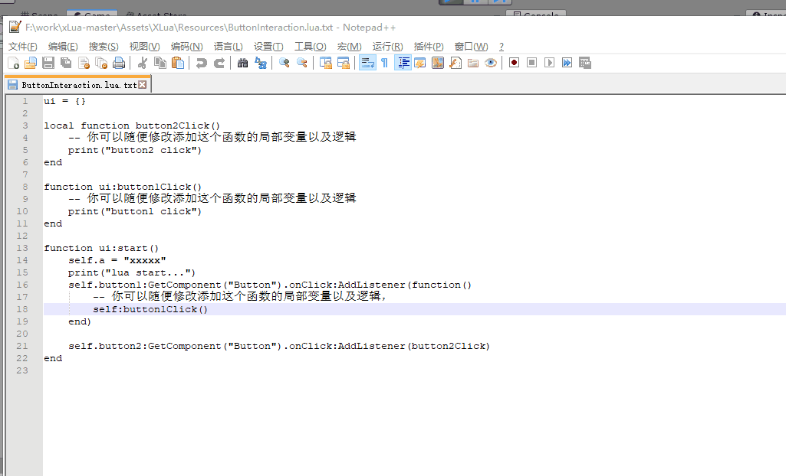

## 使用

打开 Examples 里面的 UI scene，然后修改 Resources 目录下的 ButtonInteraction.lua.txt 中的 两个click函数

函数开始的执行代码
```
local hardreload = require 'hardreload'
require = hardreload.require
```
某个文件,假设为 updatefileName.lua，发生变化的时候执行
```
local hardreload = require 'hardreload' 
hardreload.reload(updatefileName);
```
unity 结合 类AssetPostprocessor进行使用



## 特点
没有啥代码格式限制，基本上的只要你调用一个 reload函数输入参数文件名即可

## 说明

```
ui = {}

-- 修改a、b两个变量无法 热重载，无法添加 local变量
local a = 12345
local b = {test = 2}

local function button2Click()
	-- 你可以随便修改添加这个函数的局部变量以及逻辑
	local c = "foo c"
	local d = "foo d"
	print("button233 click:" .."c:".. tostring(c)  .." a:".. tostring(a))
	print("d:" .. d)
end

local function button1Click()
	-- 你可以随便修改添加这个函数的局部变量以及逻辑
	print("button1 click:" .. tostring(a))
end

function ui:start()
	print("lua start...")
	self.button1:GetComponent("Button").onClick:AddListener(function()
		-- 你可以随便修改添加这个函数的局部变量以及逻辑
		print("callback click:" .. "a:" ..tostring(a) .."b.test:" ..tostring(b.test))
		button1Click()
	end)

	self.button2:GetComponent("Button").onClick:AddListener(button2Click)
end
```

## 已知问题
* 直接修改函数外部的local变量无法热重载，如果修改一个外部的local函数内容可以热重载
* 删掉一个local 函数，然后再次添加回去 函数之后无法热重载，建议多多使用self函数

## 联系方式
如果您发现啥BUG可以加入QQ群：[882425563](https://jq.qq.com/?_wv=1027&k=5QkOBSc) 与我们联系

## 使用框架地址
https://github.com/cloudwu/luareload/tree/proto